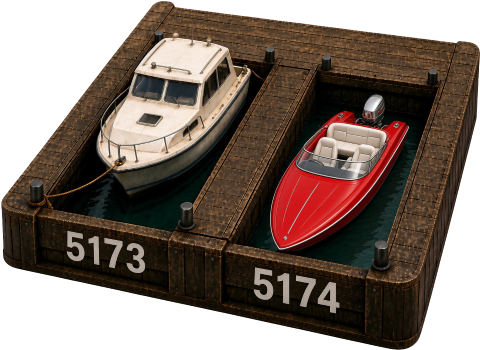

<p align="center">
  
</p>

# LocalBerth

**Local DNS for ports.**

> **berth** *n.* *a ship's allotted place at a dock.*

Vite hands out 5173, then 5174. Reboot, and they swap. Name the port so they do not.

**localhost** is the machine; **LocalBerth** is the slip.

**Docs:** [localberth.com/docs](https://localberth.com/docs) · **Site:** [localberth.com](https://localberth.com)

## Install

```bash
npm i -g localberth
localberth claim foo --port 5173
localberth serve
```

or `pnpm add -g localberth`. Node.js 20+.

## Quick start

```bash
localberth claim foo --port 5173
localberth claim bar --port 5174
localberth get foo
localberth serve --host 0.0.0.0
```

`get` prints only the port, for scripts. `--lan` binds `0.0.0.0` and syncs an inbound firewall allow.

## What you get

Named leases. A dashboard on **54321** (operator table on loopback, visitor tiles on the phone). Firewall sync on Windows, macOS, and Linux. A Vite helper that pins host and port. Flags live in the [docs](https://localberth.com/docs).

## Development

```bash
pnpm install
pnpm test
pnpm cli ls
```

Site (FilePress + docs mount): `pnpm --dir site ship`

Apache-2.0 · Catalyst Forge, LLC
